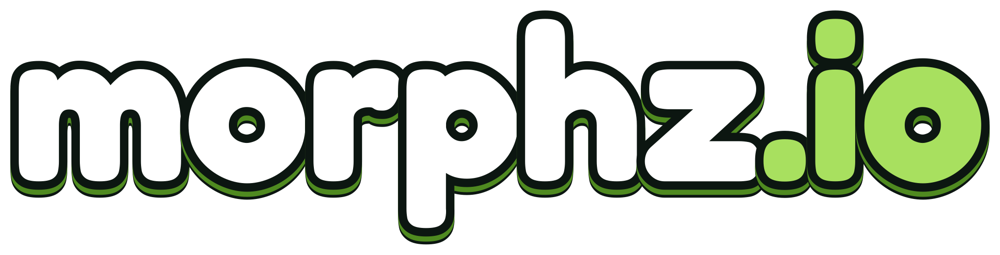
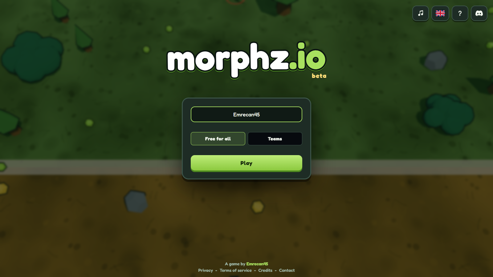
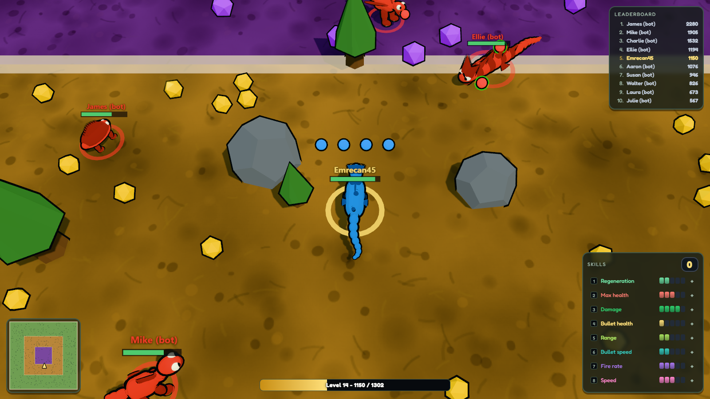
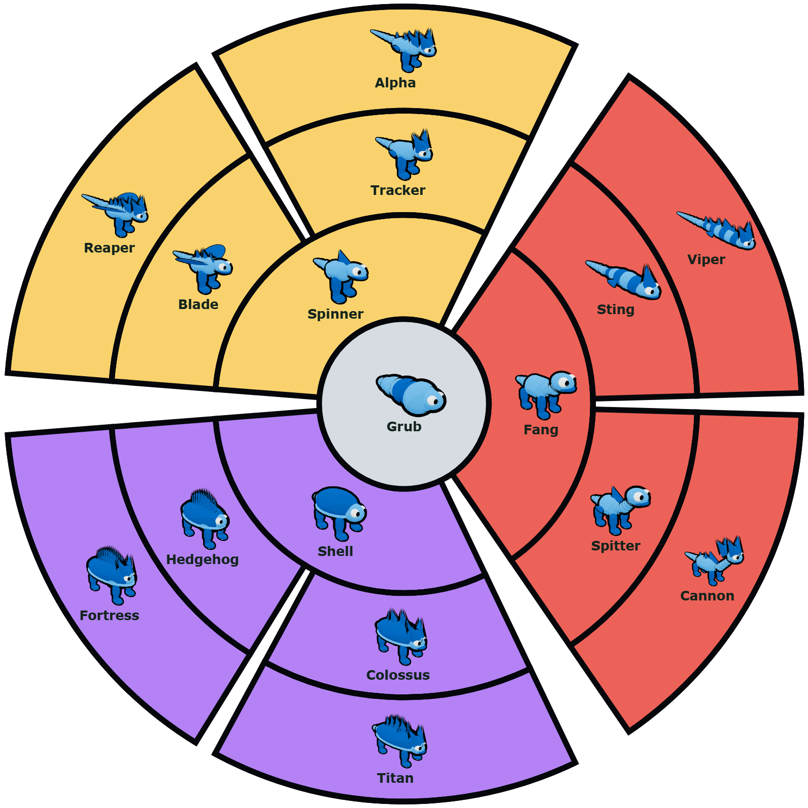

**morphz.io** is a **3D evolution .io game** playable straight in the browser, built in **JavaScript**
with **Three.js**.

You start as a ridiculous grub. You eat, you grow, and at every tier you pick your next shape.
Your body changes on screen, your weapon changes with it, and a few minutes in everyone reads your
silhouette from across the arena.
You die, you lose everything, you start over as a grub.

## 📷 Screenshots

| The menu | The arena |
|:-:|:-:|
|  |  |

## 🎮 Gameplay

Understandable in three seconds, deep through the tree rather than through your fingers.

- **Two controls:** move, attack. Nothing else to learn.
- **You grow during the match.** Eating crystals raises your biomass. At each tier you pick your next
  shape among two or three.
- **The choice is final for the match.** That is what makes you replay it: this time I go Cannon.
- **You have everything to lose.** On death you drop back to a grub and your mass scatters on the
  ground as crystals for everyone else. The bigger you were, the richer the pile.
- **Big does not win by default.** Every weapon has a window where it is helpless, and a fast, well
  played creature kills a distracted colossus.

## 🌳 The sixteen creatures

Sixteen shapes, four tiers. Everyone starts as a Grub and comes back to it on death. At every tier
the game offers you two or three shapes and the one you pick is yours for that life. The dot is the
branch colour, the same one the shape wears in the evolution tree and on the choice cards.

**Tier 0**

- ⚪ **Grub** - one weak bullet and a reach so short it has to be almost touching. Its only job is to
  make you want to leave it behind.

**Tier 1**

- 🟡 **Spinner** - a burst of two bullets, and it is ready to fire again quickly.
- 🔴 **Fang** - one heavy bullet that goes through the body it hits and carries on to the next, and it
  outreaches everything else at its tier.
- 🟣 **Shell** - three bullets in a fan, hard to dodge up close, wasted at range.

**Tier 2**

- 🟡 **Blade** - a burst of three bullets, then a reload where you are naked.
- 🟡 **Tracker** - three bullets side by side and the best speed of its tier, built to chase.
- 🔴 **Sting** - a bullet that goes through and poisons. It keeps eating at you long after you ran away.
- 🔴 **Spitter** - a slow heavy shell that shoves it backwards on every shot. Devastating at range,
  helpless in your face.
- 🟣 **Colossus** - four bullets in a wide fan.
- 🟣 **Hedgehog** - six bullets all the way around itself, so nothing can come at it from behind.

**Tier 3**

- 🟡 **Reaper** - a burst of four bullets, the longest in the game.
- 🟡 **Alpha** - four heavy bullets fired side by side.
- 🔴 **Viper** - one poisoned bullet ahead and one behind, both going through the body they hit.
- 🔴 **Cannon** - the heaviest shell in the game, and it goes through two bodies before stopping. The
  wait between two shots is long enough to lose the fight.
- 🟣 **Titan** - five bullets in a wide fan and a wall of health, impossible to break from the front.
- 🟣 **Fortress** - eight bullets all around. It does not aim, it covers everything within
  reach.

Big does not win by default. Every weapon has a window where it is helpless, and the six final shapes
are deliberately equivalent in raw power, so the shape you pick is a way to play rather than a rank.

## 🎯 The three rings

The arena is concentric and that is the whole tension of the game.

| Ring | Crystals | What you find there |
|--|:-:|--|
| 🟩 The Rim | Poor | Quiet and survivable. You spawn here and nowhere else. |
| 🟨 The Pits | Good | Profitable, and crowded. |
| 🟪 The Core | Huge | Rich, dense, full of monsters. |

You cannot grow fast while staying safe. The player decides when to go deeper.

## 🌐 Game modes

Everyone joins a room the same way, like any other .io game.

- **Free for all** - Everyone against everyone. The leaderboard is the only thing that matters.
- **Teams** - Red against blue, an endless duel over capture zones. The first zone opens a while
  into the match and a new one comes back regularly. Hold one at full colour until its meter fills
  and every living member of the holding team banks a fat share of biomass. Walking into the enemy
  base kills you instantly.

Rooms are never empty and a match is always running, so you drop straight into a live arena instead
of waiting on a lobby. When no server can be reached the whole match runs in the browser instead, and
there the opponents say what they are: they carry a bot tag next to their name and play deliberately
worse.

The game speaks seven languages, picked from the browser on first launch: English, French, Spanish,
German, Portuguese, Russian and Turkish. Nicknames are filtered in all of them.

## 🌿 Bushes and cover

Bushes hide you. They do not protect you. A bullet fired into a bush travels through it and hits
whatever is inside, so a player who sees their shots stop knows exactly where you are.

## 🕹️ Controls

| Action | PC | Touch |
|--|--|--|
| Move | `W` `A` `S` `D` or arrows | Left stick |
| Aim | Mouse | Right stick |
| Attack | Click or `Space` | Hold the right stick |
| Pick a shape | Click the card or `1` `2` `3` | Tap the card |
| Spend a skill point | `1` to `8` | Tap the skill |
| Fold the skill panel | Click the header | Tap the header |
| Pause | `Escape` | The ⏸ button |
| Mute the music | `M` | The note button, in the menu |

On a phone the game asks for landscape, then draws two sticks: the left one moves, the right one aims
and fires as long as you hold it.

## ✉️ Contact

A bug, an idea, a partnership? The contact form sits in the footer of the menu and never leaves the
page. Leaving your email address is optional: fill it in only if you want an answer.

## 🎨 Credits

Every visual in the game is original work. The only audio is a single CC0 music loop, and it can be
muted from the menu. The same credits are readable in the game itself, from the footer of the menu,
and the full details with the third party licences are in [`CREDITS.md`](CREDITS.md).

## 📄 License

This project is distributed under an **All Rights Reserved** license. Copying, publishing or
commercially exploiting this game or its code is strictly forbidden. The repository is public to show
what the game is, not to be redeployed elsewhere: the steps to build and host a copy are deliberately
absent. See [`LICENSE`](LICENSE) for details.
